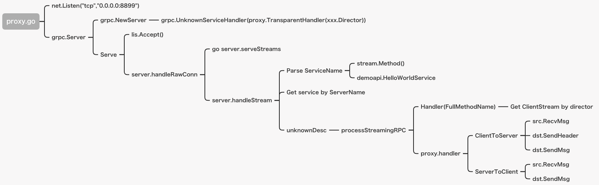

# IVC Gateway

# 插件设计
rpc-pigeon 中采用插件设计，插件之间低耦合设计。<br>
pkg 目录下包含 core 和 plugins，core 包含插件中共用的组件服务，plugins 包含各个插件，如下：

pkg<br/>
├──core<br/>
│   └── log<br/>
└──plugins<br/>
    ├── httpserver<br/>
    ├── kvs<br/>
    ├── metrics<br/>
    ├── pool<br/>
    ├── proxy<br/>
    └── plugin.go

- httpserver : api server 插件，提供 api服务；
- kvs : k8s 插件，提供自动虚拟化服务；
- metrics : 指标数据监控插件，提供指标数据采集、聚合服务；
- pool : gRPC、TCP 等连接池插件，提供资源连接管理等服务；
- proxy：gRPC、HTTP 方向代理插件，提供方向代理服务；
  
各插件通过注册方式进行运行，如：
```go
var httpPlugin, gRPCPlugin proxy.Plugin
gRPCPluginChan := registerProxy(gRPCPlugin.GRPCServer)  // 注册 gRPC Server 
httpPluginChan := registerProxy(httpPlugin.HttpServer)  // 注册 HTTP API Server 
var metricsPlugin metrics.Plugin
metricsPluginChan := registerProxy(metricsPlugin.ShowMetrics) // 注册 Metrics 数据服务 
<-gRPCPluginChan
<-httpPluginChan
<-metricsPluginChan

```

# gRPC 连接池实现
Pool 结构体定义

```go
type Pool struct {
	clients        chan *Client
	connCurrent    int32         // 当前连接数
	capacity       int32         // 容量
	size           int32         // 容量大小 (动态变化)
	idleDur        time.Duration // 空闲时间
	maxLifeDur     time.Duration // 最大连接时间
	timeout        time.Duration // Pool 的关闭超时时间
	factor         Factory       // gRPC 工厂函数
	lock           sync.RWMutex  // 读写锁
	mode           int           // 连接池 模型
	poolRemoteAddr string        // 远程连接地址
}
```
将连接维护在 Client 中的通道中，通道的 Size 设置成连接池的大小，处理完请求后进行回收等；

## 连接池模型
- STRICT_MODE： 在实际创建连接数达上限后，Pool 中没有连接时不会新建连接 ;
- LOOSE_MODE： 在实际创建连接数达上限后，Pool 中没有连接时会新建连接 ;

## gRPC 连接工厂方法
```go
// grpc dial
func grpcDial(address string) (*grpc.ClientConn, error) {
	ctx, ctxCancel := context.WithTimeout(context.Background(), DialTimeout)
	defer ctxCancel()
	gcc, err := grpc.DialContext(ctx, address,
		grpc.WithCodec(Codec()),
		grpc.WithInsecure(),
		grpc.WithBackoffMaxDelay(BackoffMaxDelay),
		grpc.WithInitialWindowSize(InitialWindowSize),
		grpc.WithInitialConnWindowSize(InitialConnWindowSize),
		grpc.WithDefaultCallOptions(grpc.MaxCallSendMsgSize(MaxSendMsgSize)),
		grpc.WithDefaultCallOptions(grpc.MaxCallRecvMsgSize(MaxRecvMsgSize)),
		grpc.WithKeepaliveParams(keepalive.ClientParameters{
			Time:                KeepAliveTime,
			Timeout:             KeepAliveTimeout,
			PermitWithoutStream: true,
		}),
	)

	if err != nil {
		logging.Log.Error("grpc dial failed !", err)
	}

	return gcc, err
}

```
通过 grpcDial 构建工厂方法，通过 pool.factor() 完成 gRPC 连接

## 从连接池获取一个连接
```go
// 从连接池取出一个连接
func (pool *Pool) Acquire(ctx context.Context) (*Client, error) {
	if pool.IsClose() {
		return nil, errors.New("Pool is closed")
	}
	var client *Client
	now := time.Now()
	select {
	case <-ctx.Done():
		if pool.mode == STRICT_MODE {
			pool.lock.Lock()
			defer pool.lock.Unlock()

			var err error
			if pool.GetConnCurrent() >= int32(pool.capacity) {
				err = errors.New("Getting connection client timeout from pool")
			} else {
				client, err = pool.createClient()
			}
			return client, err
		} else if pool.mode == LOOSE_MODE {
			var err error
			if pool.GetConnCurrent() >= int32(pool.capacity) && pool.GetConnCurrent() <= 5*int32(pool.capacity) {
				client, err = pool.createClient()
				pool.clients <- client
			}
			return <-pool.clients, err
		}
	case client = <-pool.clients:
		if client != nil && pool.idleDur > 0 && client.timeUsed.Add(pool.idleDur).After(now) {
			client.timeUsed = now
			return client, nil
		}
	}
	// 如果连接已经是idle连接，或者是非严格模式下没有获取连接
	// 则新建一个连接同时销毁原有idle连接
	if client != nil {
		client.Destory()
	}
	client, err := pool.createClient()
	if err != nil {
		return nil, err
	}
	return client, nil
}
```
当 ctx.Done() 结束时（一般是客户端主动 Close 导致连接断开）,异常进行回收处理
1. pool.mode == STRICT_MODE （STRICT 模式），如果当前连接超过连接池范围则不会新建一个连接；
2. pool.mode == LOOSE_MODE （LOOSE 模式），如果当前连接超过连接池范围则会新建一个连接；


# gRPC 负载均衡和反向代理
代理基本原理：
1. 基于TCP启动一个gRPC代理服务网关 ;
2. 将gRPC请求的服务拦截到转发代理的一个函数中执行 ;
3. 接收客户端的请求，处理业务指标后转发给服务端 ;
4. 接收服务端的响应，处理业务指标后转发给客户端 ;

gRPC的客户端将所有的请求都发给 gRPC Server Proxy，这个代理网关实现请求转发，将gRPC Client的请求流转发到gRPC 服务实现的节点上。并将服务处理结果响应返回给客户端 。

### HandleStream 中 unknownService
在 gRPC 框架代码中的 HandleStream 存在两类服务，一类是已知服务 knownService, 第二类是 unknownService ;

已知服务 knownService 就是 gRPC 服务端代码注册到 gRPC 框架中的服务，叫做已知服务，其他没有注册的服务叫做未知服务,这个未知服务 unknownService 就是我们实现 gRPC 服务代码的关键所在;

***
要实现 gRPC 服务代理，我们在创建 gRPC 服务 grpc.NewServer 时，传递一个未知服务的 Handler，将未知服务的处理进行接管，然后通过注册的这个 Handler 实现 gRPC 代理转发的逻辑.
***

### GrpcProxyTransport 接口
GrpcProxyTransport 是自定义的 StreamDirector，将 unknownService 的请求由 GrpcProxyTransport 层处理（这里有实现比较负责的连接池 + 负载均衡 的设计），提供代理和负载的能力；


基于如上描述，gRPC 代理的原理如下：

1. 创建 gRPC 服务时，注册一个未知服务处理器 Handler 和一个自定义的编码 Codec 编码和解码，此处使用 proto 标准的 Codec；
2. 这个 Handle 给业务方预留一个 director 的接口，用于代理重定向转发的 gRPC 连接获取，这样 proxy 就可以通过 redirector 得到 gRPCServer 的 gRPC 连接。
3. Proxy 接收 gRPC 客户端的连接，并使用 gRPC 的 RecvMsg 方法，接收客户端的消息请求 ;
4. Proxy 将接收到的 gRPC 客户端消息请求，通过 SendHeader 和 SendMsg 方法发送给 gRPC 服务端 ;
5. 同样的方法，RecvMsg 接收 gRPC 服务端的响应消息，使用 SendMsg 发送给 gRPC 客户端。

至此 gRPC 代理服务就完成了消息的转发功能，限流，权限等功能可以通过转发的功能进行拦截处理 ; 
如图所示
gRPC Proxy:
<div align=center> </div>

gRPC Proxy 流程图:
<div align=center> </div>


### 均衡策略
目前支持 gRPC 均衡策略是：
1. 最少连接数 ；
2. 随机 ；

```go
// 负载均衡
func balance(pools []*Pool) *Pool {
	var index, sumSize ,size int
	if len(pools) == 1 {
		return pools[index]
	}
	// 最小连接数
	for k, pool := range pools {
		pSize := pool.Size()
		sumSize += int(pool.Size())
		if size < pSize {
			size = int(pSize)
			index = k
		}
	}
	// 随机
	if sumSize == 0 {
		index = rand.Intn(len(pools))
	}
	return pools[index]
}
```

# HTTP 反向代理
提供 HTTP 方向代理能力，提供路由热更新能力，路由信息在 RouteConfig.yaml 文件中配置，目前只支持对新增路由信息的热更新操作 ；
## 配置代理路由
在 config/RouteConfig.yaml 中定义如下：
```
route:
- path: "/users"
  method: "get"
  to: "http://*.*.*.*:8090/users"
```
字段解释：
- path: HTTP 网关路由地址
- method：请求方法
- to：目标服务地址

可以配置多条记录（保存后即可启动热更新）  

# API Server
支持 HTTP API Restful，提供配置话能力

# Virtualisation Service 虚拟化服务
虚拟化服务目前是通过实现 K8s API 和 Docker API 来完成引擎容器资源自动化部署等（如 容器创建、销毁、自动化配置等等）
## Kubernetes
K8s 采用的是 InClusterConfig 的方式进行初始化（采用 pod 内调用 K8s API，免去获取 kubeconfig 等配置的麻烦）， 对 K8s API 进行了一层封装, 如 kvs/interface.go
```go
//service
UnmarshalService(bytes []byte) corev1.Service
GetServices(apps ...string) []*corev1.Service
DeployService(svc corev1.Service) error
//deployment
UnmarshalDeployment(bytes []byte) appsv1.Deployment
DeployDeployment(deploy appsv1.Deployment) error
GetDeployments(apps ...string) []*appsv1.Deployment
//configmap
UnmarshalConfigMap(bytes []byte) corev1.ConfigMap
DeployConfigMap(cm corev1.ConfigMap) error
GetConfigMaps(cms ...string) []*corev1.ConfigMap
//statefulset
//pod
GetPodsByLabel(app string) *corev1.PodList
PodExecCommand(namespace, podName, command, containerName string) (string, string, error)

//resource delete
ResDelete(resourceType string, resName string)
```
在 clent.go 集成实现上述功能，即可满足虚拟化服务自动化能力
## Docker
暂时不支持自动化

# 运行配置
## 部署配置
- CLUSTER_ENABLED: 是否开启集群部署模式
- CLUSTER_NODE_NUM： 集群节点数量设置
- OMP_ENABLED： 是否开启 OMP （运营管理平台） 支持 
- TENANT_ENABLED： 是否开启租户模式支持 （如果 OMP_ENABLED 为true 则默认支持租户模式)
- NETWORK_MODE： 网络模式，值可选为 1:严格匹配ip+port(内网环境), 2：仅匹配端口(如：支持内网和公网环境，设置成 '0.0.0.0' )
## Runtime（运行时）配置
- RUN_MODE：运行模式（分为 dev、testing、release, dev 模式会标准输出所有日志，release 则会输出 error 日志）
- HTTP_DEBUG_MODE：HTTP Server 的运行模式
- HTTP_TIME_DURATION: HTTP 请求超时  (单位秒)
- HTTP_SERVER_PORT：HTTP Server 监听端口
- GRPC_PORT：gRPC Server 监听端口
## 连接池配置
- DIAL_TIMEOUT：连接超时时间 (单位秒)
- KEEPALIVE_TIME：长连接回话时间 (单位秒)
- TENANT_ENABLED： 是否开启多租户模式 (true 或者 false)
- GATEWAY_PROXY_ADDR： 网关接受请求地址
- ENGINE_NAME：引擎名称
- POOL_ENABLED：表示是否启用 (true 或者 false)
- POOL_MODEL：配置连接池模型 （详情查看上述文档中连接池模型）
- GATEWAY_PROXY_PORT: 请求接口
- GRPC_REQUEST_REUSABLE：连接是否可复用 (true 或者 false)
- REQUEST_IDLE_TIME： 等待时间 (单位秒)
- REQUEST_MAX_LIFE： 最大请求生命周期 (单位秒)
- REQUEST_TIMEOUT：请求关闭时间 (单位秒)
- ENGINE_LIST 是一个列表，包含了引擎列表
  - SERVER_HOST：是远程服务地址
  - ENGINE_GRPC_POOL_SIZE：是连接池大小
## 日志配置
- LOG_LEVEL：日志 level，默认为 info
- LOG_MAX_AGE：日志存储最大时长
- LOG_ROTATION_TIME：日志分割时间，默认是1天
## DB 和 Cache 设置
按需求来设置（目前暂无使用 DB 和 Cache）

# 部署与运行
## Single （单机）
### docker
```sh
docker-compose -f  docker/rpc-pigeon.yaml up 
```
## k8s
### 设置环境码
### 设置 k8s 调度策略
设置 asr 和 tts 的调度策略
```sh
kubectl label nodes nodeName zhuiyi.ai/asr=granted
kubectl label nodes nodeName zhuiyi.ai/tts=granted
```
查看调度策略 labels
```sh
kubectl get nodes nodeName --show-labels
```
删除调度策略 label
```sh
kubectl label nodes nodeName zhuiyi.ai/asr-
```

### 部署 gateway
```sh
kubectl apply -f  k8s/rpc-pigeon.yaml
```

## Cluster （集群）
分布式部署，rpc-pigeon 和 ASR/TTS 是多对多部署即可